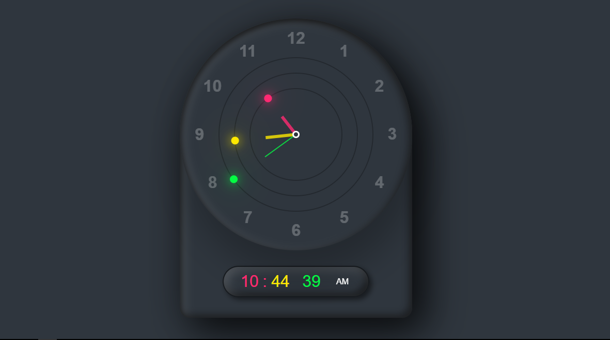

<div align="center">

  
  
  
  [](https://twitter.com/intent/follow?screen_name=mugambimungiria)

  <br />
  <br />

  <h2 align="center">Web Digital / Analog Clock</h2>

  A fully responsive web digital / analog clock, <br />Responsive for all devices, build using html, css, and javascript.

  <a href="https://mugambi12.github.io/Digital-Clock/"><strong>➥ Live Demo</strong></a>
</div>

<br />

### Demo Screeshots



### Prerequisites

Before you begin, ensure you have met the following requirements:

* [Git](https://git-scm.com/downloads "Download Git") must be installed on your operating system.

### Run Locally

To run **Digital Clock ** locally, run this command on your git bash:

Linux and macOS:

```bash
sudo git clone https://github.com/Mugambi12/Digital-Clock.git
```

Windows:

```bash
git clone https://github.com/Mugambi12/Digital-Clock.git
```

### Contact

You can reach out to me at [Twitter](https://www.twitter.com/mugambimungiria).

### License

This project is **free to use** and does not contains any license.
